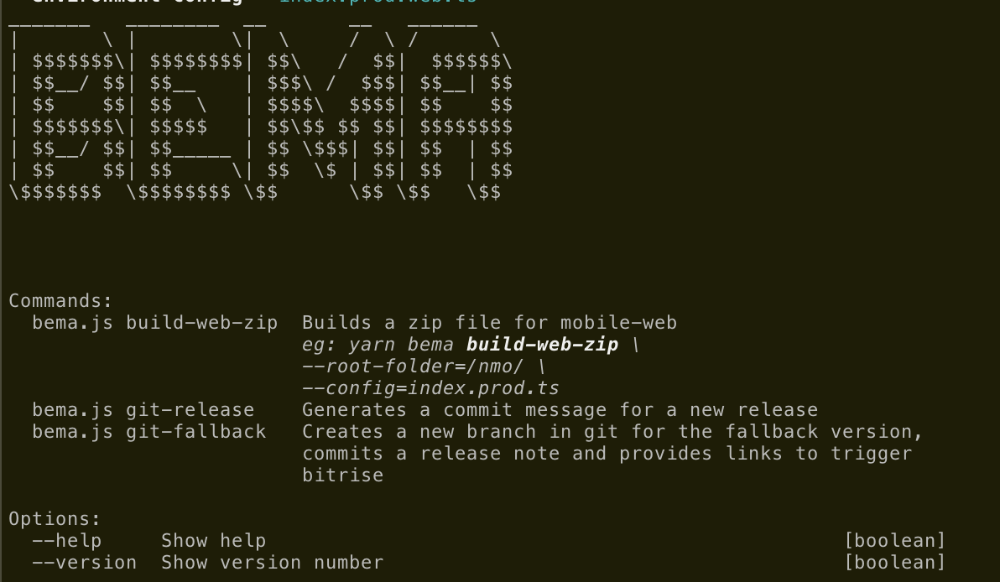
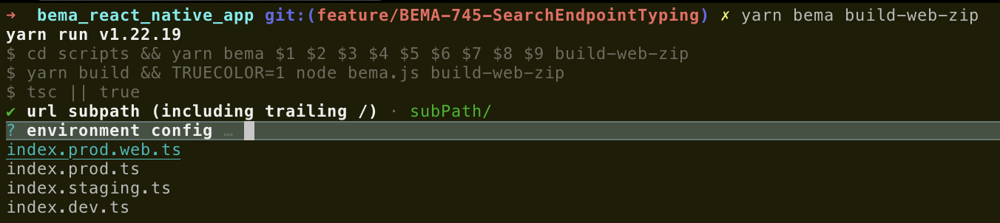

# Typescript Node CLI Tools

Created by Angelo Perera (aceslick911)



---



# What is this?

- This is a CLI tool written in typescript that can be run by developers or in CI.
- THe tool provides helpful prompts and entry validation as well as provides a single-line command to run, very helpful when setting up CI
- This is to be used for any nodejs project but comes with helpful utilities that aid react-native development
- This tool can also help understand which work tickets have been completed between releases/branches/commits and is very powerful when generating release nodes


- The tool has been designed to provide a clear nested output which catches and clearly displays error messages when exceptions are thrown - essential for debugging in CI

```
╭────────────────────────────────────────────────────────────────────────────────────────╮
│Error                                                                                   │
├────────────────────────────────────────────────────────────────────────────────────────┤
│root-folder Must end with a trailing slash                                              │
├────────────────────────────────────────────────────────────────────────────────────────┤
│Error: root-folder Must end with a trailing slash                                       │
│    at Command.handler                                                                  │
│(file:///Users/.../git/scripts/lib/commands/buildWeb.js:69:23)│
│                                                                                        │
│    at                                                                                  │
│file:///Users/.../git/scripts/node_modules/bandersnatch/lib/es│
│m/command.js:205:33                                                                     │
╰────────────────────────────────────────────────────────────────────────────────────────╯

```

```
│✔️  Create_Subfolder (0.006s)
│╭───────────────────────────────────────────────────────────────────────────────────────
││Move_To_Subfolder
│├───────────────────────────────────────────────────────────────────────────────────────
││╭──────────────────────────────────────────────────────────────────────────────────────
│││./web-build/> mv -f \
                    .well-known \
                    apple-app-site-association \
                    apple-touch-icon.png \
                    favicon.ico \
                    asset-manifest.json \
                    fonts \
                    index.html \
                    manifest.json \
                    serve.json \
                    static \
                    ./exchange/
││├──────────────────────────────────────────────────────────────────────────────────────
││││mv: rename fonts to ./exchange/fonts: No such file or directory
││╰──────────────────────────────────────────────────────────────────────────────────────
││🔴 Move_To_Subfolder (0.006s)
││
Error at 📦 Building Mobile Web Artifact.Move_To_Subfolder
││
undefined
│╰───────────────────────────────────────────────────────────────────────────────────────
│🔴 📦 Building Mobile Web Artifact (2.436s)

```

- This tool is also able to launch your CI tool and perform actions to automate repetitive manual tasks such as creating new Tickets, launching Build tools and updating documentation
eg:
```typescript
export const Actions = {
  launchBrowser: (url: string) =>
    logger.indented(
      `🌎 launchBrowser`,
      () =>
        new Promise(exit => {
          logger.info(`launching chrome...`);
          return launchBrowser(url).then(wsUrl => {
            logger.info(`ok got : wsUrl: ${wsUrl}`);

            return Actions.buildIosMaster(wsUrl);
          });

          // return exit(true);
        }),
    ),
  buildIosMaster: (
    wsUrl: string = bitriseConfig.urls.master_ios,
    branchName = 'develop',
    buildMessage = 'cli build',
    pipeline = 'rn68Primary' as keyof typeof bitriseConfig.pipelineTargets.ios,
  ) =>
    logger.indented(`📲 build ios master`, () => {
      return controlBrowser(wsUrl, bitriseConfig.urls.master_ios).then(
        async page => {
          await delay(bitriseConfig.waitTime);

          await page.clickElement({
            xpath: bitriseConfig.elements.scheduleBuildButton,
          });
          await page.setTextbox({
            xpath: bitriseConfig.elements.branchTextbox,
            value: branchName,
          });
          await page.setTextbox({
            xpath: bitriseConfig.elements.messageTextbox,
            value: buildMessage,
          });

          await delay(bitriseConfig.waitTime);

          await page.selectDropdown({
            valueSelector: bitriseConfig.pipelineTargets.ios[pipeline],
          });

          await delay(bitriseConfig.waitTime);

          await page.clickElement({
            xpath: bitriseConfig.elements.startBuildButton,
          });

          return true;
        },
      );
    }),
};

```

## How it works:

- Uses bandersnatch for nodeJS CLI workflows - [https://github.com/hongaar/bandersnatch](https://github.com/hongaar/bandersnatch)

- Start by viewing index.ts and adding commands
```typescript
...
const run = async () => {
  app.description(await text.title('TS-CLI'));

  // Add  commands here:

  // Start command workflows
  await app.run();
};
```

## How to use:

`pnpm add ts-node-cli-tools`

Available imports:

```typescript
import { text, exec, files, utils } from "ts-node-cli-tools";
```

## Building

```
pnpm i

```

# Typical configuration and usage

1. Setup your vendor specific values in [src/consts.ts](src/consts.ts)

```typescript

export const VendorSpecificValues = {
  buildNumber: 1,
  JIRAProjectKey: 'MYPROJ', // commits use "MYPROJ-1234"

  mobileWebSubPaths :[
    '/',
    '/mySubPath/',
  ],

  mobileWebDeployFileList:[
    '.well-known',
    'apple-app-site-association',
    'apple-touch-icon.png',
    'favicon.ico',
    'asset-manifest.json',
    'fonts',
    'index.html',
    'manifest.json',
    'serve.json',
    'static',
  ],

  appConfigFiles:[
    'index.prod.web.ts',
    'index.prod.ts',
    'index.staging.ts',
    'index.dev.ts',
  ]
} as const;

```

2. Run using `yarn cli` or by executing ./index.js (nodejs executable)

Examples:
```
./scripts/index.js help
```

```
_______   ________  __       __   ______
|       \ |        \|  \     /  \ /      \
| $$$$$$$\| $$$$$$$$| $$\   /  $$|  $$$$$$\
| $$__/ $$| $$__    | $$$\ /  $$$| $$__| $$
| $$    $$| $$  \   | $$$$\  $$$$| $$    $$
| $$$$$$$\| $$$$$   | $$\$$ $$ $$| $$$$$$$$
| $$__/ $$| $$_____ | $$ \$$$| $$| $$  | $$
| $$    $$| $$     \| $$  \$ | $$| $$  | $$
\$$$$$$$  \$$$$$$$$ \$$      \$$ \$$   \$$


Commands:
  ./scripts/index.js build-web-zip  Builds a zip file for mobile-web
                         eg: yarn bema build-web-zip \
                         --root-folder=/nmo/ \
                         --config=index.prod.ts
  ./scripts/index.js git-release    Generates a commit message for a new release
  ./scripts/index.js git-fallback   Creates a new branch in git for the fallback version,
                         commits a release note and provides links to trigger
                         bitrise

Options:
  --help     Show help                                                 [boolean]
  --version  Show version number                                       [boolean]
✨  Done in 1.19s.

```


```
./scripts/index.js build-web-zip \
--root-folder="/exchange/" \
--config="index.prod.web.ts"

```

```
CLI Command:
./scripts/index.js build-web-zip \
--root-folder="/exchange/" \
--config="index.prod.web.ts" \
--test="omitted"
╭─────────────────────────────────────────────────┬──────────────────────────────────────╮
│Command: build-web-zip                           │Value                                 │
├─────────────────────────────────────────────────┼──────────────────────────────────────┤
│root-folder                                      │/exchange/                            │
├─────────────────────────────────────────────────┼──────────────────────────────────────┤
│config                                           │index.prod.web.ts                     │
├─────────────────────────────────────────────────┼──────────────────────────────────────┤
│test                                             │omitted                               │
╰─────────────────────────────────────────────────┴──────────────────────────────────────╯
╭────────────────────────────────────────────────────────────────────────────────────────
│📦 Building Mobile Web Artifact
├────────────────────────────────────────────────────────────────────────────────────────
│╭───────────────────────────────────────────────────────────────────────────────────────
││Update_Versions
│├───────────────────────────────────────────────────────────────────────────────────────
││╭──────────────────────────────────────────────────────────────────────────────────────
│││> git rev-list HEAD --count
││├──────────────────────────────────────────────────────────────────────────────────────
│││12657
││├──────────────────────────────────────────────────────────────────────────────────────
│││✅ 0 ➡️  12657
││╰──────────────────────────────────────────────────────────────────────────────────────
││Updated: ./ios/BetfairMobile.xcodeproj/project.pbxproj
││  [19959-19990]: 				MARKETING_VERSION = 2.1.35;
││  [21385-21416]: 				MARKETING_VERSION = 2.1.35;
││  [24910-24941]: 				MARKETING_VERSION = 2.1.35;
││  [28443-28474]: 				MARKETING_VERSION = 2.1.35;
││To:
││  [19959-19990]: 				MARKETING_VERSION = 2.1.35;
││  [21385-21416]: 				MARKETING_VERSION = 2.1.35;
││  [28443-28474]: 				MARKETING_VERSION = 2.1.35;
││Updated: ./assets/prebuild/ios/BetfairMobile.xcodeproj/project.pbxproj
││  [19486-19517]: 				MARKETING_VERSION = 2.1.33;
││  [20912-20943]: 				MARKETING_VERSION = 2.1.33;
││  [24357-24388]: 				MARKETING_VERSION = 2.1.33;
││  [27904-27935]: 				MARKETING_VERSION = 2.1.33;
││To:
││  [19486-19517]: 				MARKETING_VERSION = 2.1.35;
││  [20912-20943]: 				MARKETING_VERSION = 2.1.35;
││  [27904-27935]: 				MARKETING_VERSION = 2.1.35;
││Updated: ./App/Config/version.json
││  [23-42]:   "minor": "12537",
││To:
││  [23-42]:   "minor": "12657",
││Updated: ./app.json
││  [212-243]:       "last-release": "2.1.34",
││To:
││  [212-243]:       "last-release": "2.1.35",
│╰───────────────────────────────────────────────────────────────────────────────────────
│✔️  Update_Versions (0.133s)
│╭───────────────────────────────────────────────────────────────────────────────────────
││runBuildWebZip
│├───────────────────────────────────────────────────────────────────────────────────────
││homepage set to: "/exchange/"
││Skipped deleting file: "App/Config/index.ts"
││Copied file: "/Users/.../git/App/Config/index.prod.web.ts"
││  Previewing: App/Config/index.ts
││  [24-88]: const APIGATEWAY_BASE_URL = 'https://production.ausnav.online/';
│╰───────────────────────────────────────────────────────────────────────────────────────
│✔️  runBuildWebZip (0.003s)
│╭───────────────────────────────────────────────────────────────────────────────────────
││Run_Expo_Web_Build
│├───────────────────────────────────────────────────────────────────────────────────────
││╭──────────────────────────────────────────────────────────────────────────────────────
│││> expo build:web
││├──────────────────────────────────────────────────────────────────────────────────────
│││› Favicon: No template image found, skipping auto generation...
│││› Safari Icons: No template image found, skipping auto generation...
│││› Safari Splash Screens: No template image found, skipping auto generation...
│││› Chrome Icons: No template image found, skipping auto generation...
│││[14:25:55] Web Bundling complete 17260ms
││││[14:25:55] asset size limit: The following asset(s) exceed the recommended size limit (586 KiB).
││││[14:25:55] This can impact web performance.
││││[14:25:55] Assets:
││││[14:25:55]   ./fonts/MaterialCommunityIcons.ttf (1.09 MiB)
││││[14:25:55]   static/js/app.75095024.chunk.js (1.12 MiB)
││││[14:25:55]   static/js/8.96b7e691.chunk.js (2.42 MiB)
││││[14:25:55] entrypoint size limit: The following entrypoint(s) combined asset size exceeds the recommended limit (586 KiB). This can impact web performance.
││││[14:25:55] Entrypoints:
││││[14:25:55]   app (3.54 MiB)
││││[14:25:55]       static/js/runtime~app.781d4126.js
││││[14:25:55]       static/js/8.96b7e691.chunk.js
││││[14:25:55]       static/js/app.75095024.chunk.js
││││[14:25:55]
││││[14:25:55] Compiled with warnings.
││││[14:25:55]
││││[14:25:55] asset size limit: The following asset(s) exceed the recommended size limit (586 KiB).
││││[14:25:55] This can impact web performance.
││││[14:25:55] Assets:
││││[14:25:55]   ./fonts/MaterialCommunityIcons.ttf (1.09 MiB)
││││[14:25:55]   static/js/app.75095024.chunk.js (1.12 MiB)
││││[14:25:55]   static/js/8.96b7e691.chunk.js (2.42 MiB)
││││[14:25:55]
││││[14:25:55] entrypoint size limit: The following entrypoint(s) combined asset size exceeds the recommended limit (586 KiB). This can impact web performance.
││││[14:25:55] Entrypoints:
││││[14:25:55]   app (3.54 MiB)
││││[14:25:55]       static/js/runtime~app.781d4126.js
││││[14:25:55]       static/js/8.96b7e691.chunk.js
││││[14:25:55]       static/js/app.75095024.chunk.js
││├──────────────────────────────────────────────────────────────────────────────────────
│││✅ 0 ➡️  › Favicon: No template image found, skipping auto generation...
│││› Safari Icons: No template image found, skipping auto generation...
│││› Safari Splash Screens: No template image found, skipping auto generation...
│││› Chrome Icons: No template image found, skipping auto generation...
│││[14:25:55] Web Bundling complete 17260ms
││╰──────────────────────────────────────────────────────────────────────────────────────
│╰───────────────────────────────────────────────────────────────────────────────────────
│✔️  Run_Expo_Web_Build (19.392s)
│╭───────────────────────────────────────────────────────────────────────────────────────
││Create_Subfolder
│├───────────────────────────────────────────────────────────────────────────────────────
││╭──────────────────────────────────────────────────────────────────────────────────────
│││./web-build/> mkdir -p ./exchange/
││├──────────────────────────────────────────────────────────────────────────────────────
│││✅ 0
││╰──────────────────────────────────────────────────────────────────────────────────────
│╰───────────────────────────────────────────────────────────────────────────────────────
│✔️  Create_Subfolder (0.007s)
│╭───────────────────────────────────────────────────────────────────────────────────────
││Move_To_Subfolder
│├───────────────────────────────────────────────────────────────────────────────────────
││╭──────────────────────────────────────────────────────────────────────────────────────
│││./web-build/> mv -f \
                    .well-known \
                    apple-app-site-association \
                    apple-touch-icon.png \
                    favicon.ico \
                    asset-manifest.json \
                    fonts \
                    index.html \
                    manifest.json \
                    serve.json \
                    static \
                    ./exchange/
││├──────────────────────────────────────────────────────────────────────────────────────
│││✅ 0
││╰──────────────────────────────────────────────────────────────────────────────────────
│╰───────────────────────────────────────────────────────────────────────────────────────
│✔️  Move_To_Subfolder (0.006s)
│✅ Build complete: build-web-zip
╰────────────────────────────────────────────────────────────────────────────────────────
│✔️  📦 Building Mobile Web Artifact (19.541s)
✨  Done in 20.87s.

```


```
./scripts/index.js git-release \
--release-name="MARCH_MATCHME_2023" \
--desc="Matchme Soft Launch  " \
--from="origin/release/2/1/33-BEMA-701-MobileWeb-FEB2023-UIFixes" \
--to="origin/master" \
--ver="1.1.35" \
--beta-build="1"


╭───────────────────────┬────────────────────────────────────────────────────────────────╮
│Command: git-release   │Value                                                           │
├───────────────────────┼────────────────────────────────────────────────────────────────┤
│release-name           │MARCH_MATCHME_2023                                                        │
├───────────────────────┼────────────────────────────────────────────────────────────────┤
│desc                   │Matchme Soft Launch                                             │
├───────────────────────┼────────────────────────────────────────────────────────────────┤
│from                   │origin/release/2/1/33-BEMA-701-MobileWeb-FEB2023-UIFixes        │
├───────────────────────┼────────────────────────────────────────────────────────────────┤
│to                     │origin/master                                                   │
├───────────────────────┼────────────────────────────────────────────────────────────────┤
│ver                    │1.1.35                                                          │
├───────────────────────┼────────────────────────────────────────────────────────────────┤
│beta-build             │1                                                               │
╰───────────────────────┴────────────────────────────────────────────────────────────────╯
╭────────────────────────────────────────────────────────────────────────────────────────
│📦 Automated Create releaseMessage Version
├────────────────────────────────────────────────────────────────────────────

  simple-git:task:log:1 [SPAWN] git [ 'log', '--pretty=format:òòòòòò %H ò %aI ò +1ms ò %D ò %B ò %aN ò %aE òò', 'origin/release/2/1/33-BEMA-701-MobileWeb-FEB2023-UIFixes...origin/master' ]
  

🚅 MARCH_MATCHME_2023 v1.1.35 Beta 1 UAT Train
Matchme Soft Launch

Trains (6)
- QA Train 09-03-2023
 -QA Train 08-03-2023
 -QA Train 06-03-2023
 -Merged in develop (pull request #3591)
 -QA Train 28
 -QA Train 21-02-2023

Tickets (21)
- BEMA-577, BEMA-728, BEMA-597, BEMA-704, BEMA-71, BEMA-705, BEMA-712, BEMA-719, BEMA-62, BEMA-724, BEMA-464, BEMA-693, BEMA-667, BEMA-674, BEMA-669, BEMA-671, BEMA-640, BEMA-651, BEMA-690, BEMA-576, BEMA-510

> QA Train 09-03-2023


- BEMA-577: MatchMe - Productionalize PoC
- BEMA-728: Implement a banner to indicate test environment is utilised
- BEMA-597: Alter Mobile web build scripts to support new mobile web style of deployments.


```